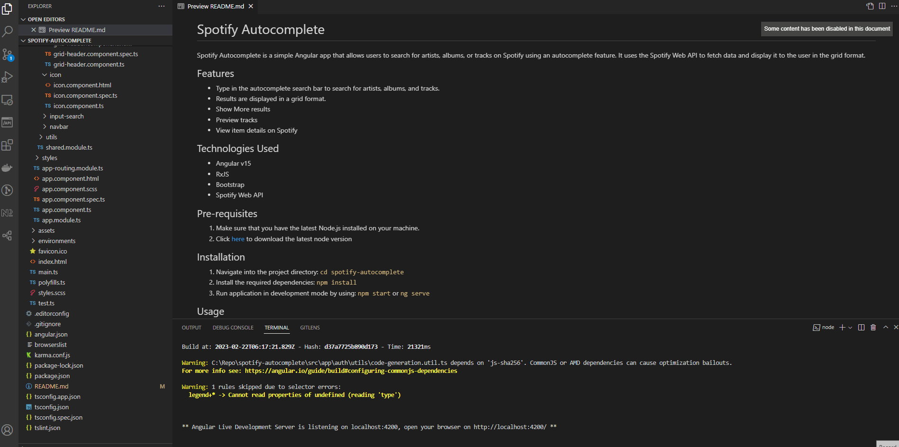

# Spotify Autocomplete
Spotify Autocomplete is a simple Angular app that allows users to search for artists, albums, or tracks on Spotify using an autocomplete feature.
It uses the Spotify Web API to fetch data and display it to the user in the grid format.

## Features
- Type in the autocomplete search bar to search for artists, albums, and tracks.
- Results are displayed in a grid format.
- Show More results
- Preview tracks
- View item details on Spotify

## Technologies Used
- Angular v15
- RxJS
- Bootstrap
- Spotify Web API

## Pre-requisites
1. Make sure that you have the latest Node.js installed on your machine.
2. Click [here](https://nodejs.org/en/download/) to download the latest node version

## Installation
1. Navigate into the project directory: `cd spotify-autocomplete`
2. Install the required dependencies: `npm install`
3. Run application in development mode by using: `npm start` or `ng serve`

## Usage

1. After launching the app on `localhost://4200`, the auth flow will be triggered.
2. You will be redirected to Spotify where you will need to login
    - Note that sometimes it might throw error 'Incorrect email/password'. In this case, choose 'Continue with Google'. This works everytime for me.
3. Once the authentication is successful, you will be redirected back to the search page of the application.
4. You can them use the search input to type query. No need to press enter
5. Results will appear based on query
    - Click on play icon (if available) to preview tracks
    - Click on image to view item details on Spotify
    - Click on Show More to display more results
    - A .gif file has been added to demonstrate the search flow

## Achievements
- Code was structured properly with a clear separation of concerns
- Coding best practices were followed
- Unit tests have been added
- Support for all latest and stable browsers through Bootstrap 5
- Spotify Authorization Code Flow OAuth 2.0 was implemented

## Possible Future Expansion
- Implement Share functionality for sharing tracks
- Implement Add to playlist
- Implement Play functionality for playing tracks

